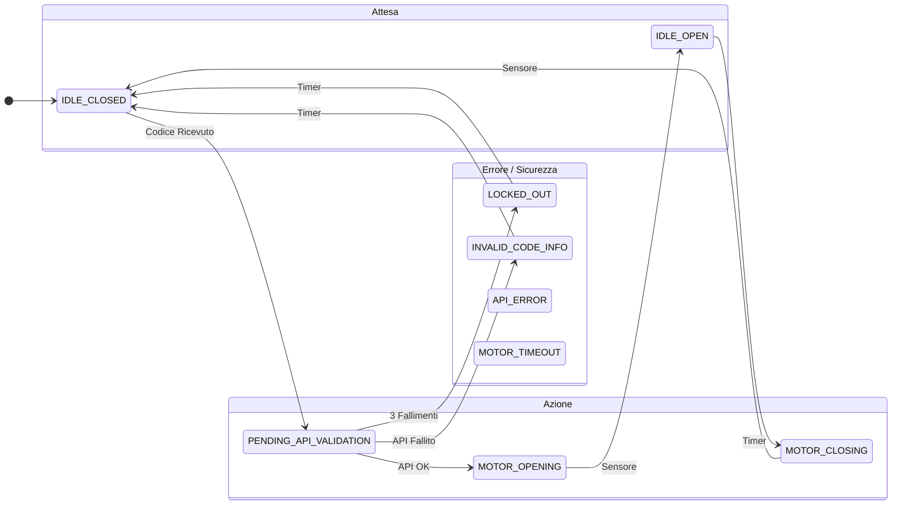

# 🧠 Il Cervello del Nostro SmartCadenas: Macchina a Stati e Architettura Non Bloccante

In questo documento, spiego come abbiamo progettato il cuore del nostro sistema, il `door_operation_manager`, e come abbiamo assicurato che l'intera applicazione sia reattiva e affidabile.

## 1\. Perché Abbiamo Scelto una Macchina a Stati?

All'inizio del progetto, ci siamo resi conto che la logica della serratura poteva diventare molto complessa. Per evitare di scrivere un codice disordinato e difficile da mantenere, pieno di `if... else...` nidificati, abbiamo deciso di adottare un approccio più strutturato: una **Macchina a Stati Finiti (FSM)**.

L'idea è semplice:

1.  Il nostro sistema può trovarsi in **un solo stato** alla volta (è `chiuso`, o `in apertura`, ma mai entrambi).
2.  Il passaggio da uno stato all'altro (una **transizione**) avviene solo in risposta a un **evento** ben preciso.

Questo approccio ci ha permesso di creare un sistema dal comportamento **prevedibile, robusto e molto più semplice da testare e correggere**.

## 2\. Gli Stati del Sistema che Abbiamo Definito (`DoorOpState`)

Abbiamo identificato e definito tutti gli stati possibili della serratura nel nostro file `door_operation_manager.h`.

| Stato                    | Cosa Significa nel Nostro Sistema                                                                                             |
|--------------------------|-------------------------------------------------------------------------------------------------------------------------------|
| `IDLE_CLOSED`            | **A riposo, porta chiusa.** Questo è lo stato di default. Il sistema attende un codice o la pressione del pulsante di uscita. |
| `IDLE_OPEN`              | **A riposo, porta aperta.** Il motore è fermo. Il sistema attende prima di avviare la chiusura automatica.                    |
| `IDLE_AJAR`              | **Porta socchiusa.** Uno stato di attesa anomalo, la porta non è né aperta né chiusa.                                         |
| `PENDING_API_VALIDATION` | **Validazione in corso.** Abbiamo ricevuto un codice e stiamo contattando il server per validarlo.                            |
| `MOTOR_OPENING`          | **Azione: Apertura.** Il motore sta girando per aprire la serratura.                                                          |
| `MOTOR_CLOSING`          | **Azione: Chiusura.** Il motore sta girando per chiudere la serratura.                                                        |
| `LOCKED_OUT`             | **Sicurezza: Bloccato.** Troppi errori di codice. Il sistema è "in punizione" e ignora nuovi tentativi per 60 secondi.        |
| `INVALID_CODE_INFO`      | **Feedback: Errore codice.** Stato temporaneo per visualizzare "Codice Invalido" per 3 secondi.                               |
| `API_ERROR`              | **Errore: Problema di rete.** Visualizza un errore di comunicazione per 3 secondi.                                            |
| `MOTOR_TIMEOUT`          | **Errore: Problema al motore.** Visualizza un errore del motore per 3 secondi.                                                |

## 3\. Il Motore della Logica: La Nostra Task `door_op_manager_task()`

Questa funzione è il cuore pulsante della nostra logica. L'abbiamo progettata per essere chiamata continuamente dal nostro `scheduler`. Ad ogni ciclo, esegue una sequenza di decisioni molto rapida:

1.  **Controlli Prioritari:** Per prima cosa, gestisce gli eventi urgenti, come la **rilevazione di forzatura** o la **pressione del pulsante di uscita**. Questi controlli hanno la precedenza su tutto il resto.
2.  **Logica di Stato:** Successivamente, esegue il codice specifico per lo stato corrente tramite uno `switch (current_op_state)`. È qui che prendiamo le decisioni su come reagire e se passare a un nuovo stato.

## 4\. Le Transizioni: Come il Sistema Cambia Stato

Il passaggio da uno stato all'altro è la conseguenza diretta di un evento. Ecco come l'abbiamo implementato:

| Se ci troviamo nello stato... | E si verifica l'evento...                               | Allora passiamo allo stato... |
|-------------------------------|---------------------------------------------------------|-------------------------------|
| `IDLE_CLOSED`                 | Un codice IR è stato completamente inserito             | `PENDING_API_VALIDATION`      |
| `PENDING_API_VALIDATION`      | La risposta dall'API è "Successo"                       | `MOTOR_OPENING`               |
| `PENDING_API_VALIDATION`      | La risposta dall'API è "Fallimento" (1° o 2° tentativo) | `INVALID_CODE_INFO`           |
| `PENDING_API_VALIDATION`      | La risposta dall'API è "Fallimento" (3° tentativo)      | `LOCKED_OUT`                  |
| `MOTOR_OPENING`               | Il sensore "porta aperta" viene attivato                | `IDLE_OPEN`                   |
| `IDLE_OPEN`                   | Il timer di auto-chiusura (15s) scade                   | `MOTOR_CLOSING`               |
| `MOTOR_CLOSING`               | Il sensore "porta chiusa" viene attivato                | `IDLE_CLOSED`                 |
| (Quasi qualsiasi stato)       | Il pulsante di uscita viene premuto                     | `MOTOR_OPENING`               |

## 5\. Come i Moduli "Parlano" tra Loro: L'Orchestrazione

Questa è una parte fondamentale del nostro design. La macchina a stati non "comunica" il suo stato agli altri moduli. Invece, agisce come un **direttore d'orchestra**. Il cambio di stato **provoca delle azioni**, che sono chiamate dirette a funzioni negli altri moduli.

**Ecco un esempio pratico del nostro flusso:**

1.  Il nostro sistema è in `PENDING_API_VALIDATION`.
2.  L'API risponde "Successo".
3.  Nel ciclo successivo, il nostro `door_op_manager` vede la risposta e **decide di cambiare stato** in `MOTOR_OPENING`.
4.  Nel ciclo immediatamente dopo, lo `switch` esegue ora il caso `MOTOR_OPENING`. Il codice che abbiamo scritto all'interno di questo caso **chiama direttamente la funzione** `door_motor_open()` dal nostro modulo `door_motor_manager`.

Quindi, la nostra comunicazione è **orchestrata**:

- I moduli di basso livello (I/O) forniscono informazioni (`ir_manager` dice "nuovo tasto premuto").
- Il `door_operation_manager` riceve queste informazioni, prende una decisione (cambia stato) e **dà ordini** (`door_motor_manager`, "apriti\!").

## 6\. Il Segreto della Reattività: La Nostra Architettura Non Bloccante

Una delle sfide più grandi nei sistemi embedded è rimanere reattivi. Se il nostro sistema fosse "bloccato" ad attendere un timer, non potrebbe leggere un nuovo input dall'utente. Per questo, abbiamo evitato a tutti i costi la funzione `delay()`.

Abbiamo implementato la reattività con due tecniche chiave:

**1. Lo Scheduler (Il Direttore d'Orchestra)**

Il nostro `main.cpp` ha un `loop()` quasi vuoto. L'unica cosa che fa è chiamare `scheduler.run()`. Nel `setup()`, abbiamo registrato le nostre task principali (`door_op_manager_task`, `ir_code_input_logic_task`, etc.). Lo scheduler è un semplice ciclo che esegue ogni task, una dopo l'altra, molto rapidamente.

**2. Task Brevi e Gestione del Tempo con `millis()`**

Ogni nostra task è progettata per essere velocissima. Per gestire le attese, non usiamo `delay()`, ma `millis()`, che è il cronometro interno del microcontrollore.

**Esempio:** Per lo stato `LOCKED_OUT` di 60 secondi.
Invece di scrivere `delay(60000);` (che bloccherebbe tutto), abbiamo fatto così:

```cpp
// Quando entriamo nello stato LOCKED_OUT, registriamo l'ora di inizio
timer_activity_start_ms = millis(); 

// ... poi, nella task che viene eseguita in loop ...

// Questo controllo è istantaneo e non blocca nulla
if (millis() - timer_activity_start_ms > LOCKOUT_DURATION_MS) {
  // I 60 secondi sono passati, quindi cambiamo stato.
}
```

**L'analogia che usiamo** è quella di uno chef: non fissa una pentola per 30 minuti (bloccante), ma la controlla, poi si dedica ad altro, controlla un'altra pentola, e così via (non bloccante). Il nostro `scheduler` è lo chef.

Questa architettura `scheduler` + `millis()` è ciò che rende il nostro SmartCadenas reattivo e capace di gestire più cose contemporaneamente.

## 7\. Schema Visivo Riepilogativo

