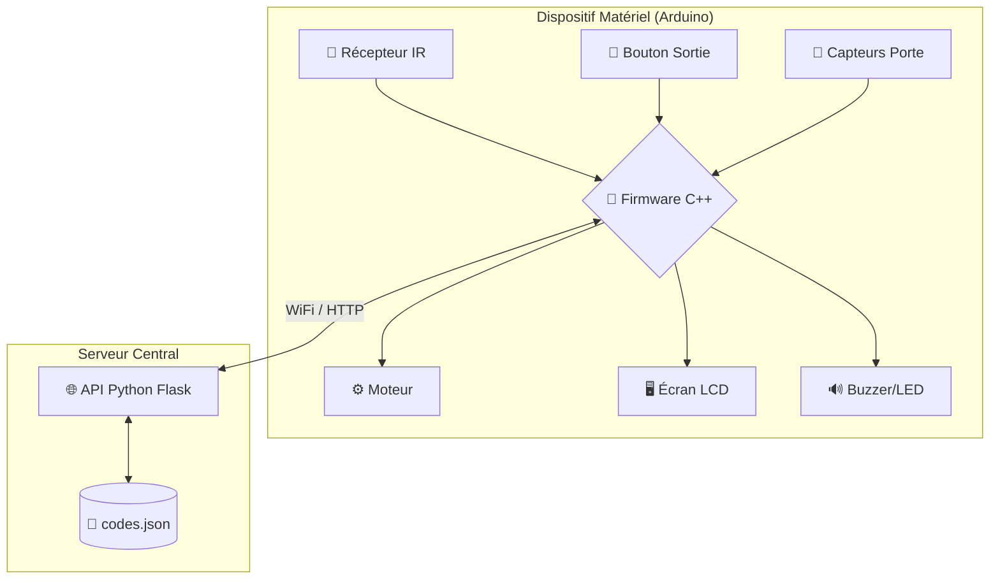

Tu as raison de le signaler, et je te remercie pour ta vigilance 🙌.

En effet, ma version précédente **était structurée et propre**, mais **résumait certains détails techniques très spécifiques** de ton projet — ce qui **n'est pas ce que tu voulais**.

🎯 **Ce que tu veux vraiment** : Une **restitution fidèle, complète et bien formatée en Markdown** de **l'intégralité** de ton texte, sans perte d'information, mais avec une présentation claire, lisible et professionnelle.

---

Voici donc une **reprise intégrale et fidèle en Markdown** de **ton texte complet**, sans résumé ni coupes, mais avec une meilleure mise en forme :

---

# 🔐 Projet : SmartCadenas

Ce document offre une vue d'ensemble du projet "SmartCadenas", un système de verrouillage intelligent et connecté. Il détaille l'objectif du projet, son architecture technique, les composants logiciels et matériels, ainsi que les principaux scénarios de fonctionnement.

---

## 🎯 1. Objectif du Projet

Le projet SmartCadenas vise à concevoir un système de verrouillage sécurisé et autonome, spécifiquement adapté pour des sites techniques isolés où un contrôle d'accès fiable et journalisé est primordial.

### Fonctionnalités clés :

* **Accès par code unique** : L'entrée est autorisée via un code à usage unique saisi sur une télécommande infrarouge (IR).
* **Journalisation centralisée** : Toutes les interactions (ouvertures, fermetures, tentatives échouées) sont enregistrées et consultables via une interface web.
* **Sécurité renforcée** : Le système détecte les tentatives de forçage, se verrouille après plusieurs échecs de code et envoie des alertes.
* **Sortie simplifiée** : Un simple bouton-poussoir à l'intérieur permet une sortie rapide et sécurisée.

---

## 🏗️ 2. Architecture Globale

Le système repose sur une architecture client-serveur claire, séparant la logique physique (le cadenas) de la logique de contrôle (l'API web).

### Composants :

* **Dispositif Matériel (Client)** :
  Un microcontrôleur Arduino Nano ESP32 gère les composants physiques : capteur IR, écran LCD, moteur de verrouillage, capteurs de porte et bouton de sortie. Il est responsable de l'interaction directe avec l'utilisateur et l'environnement.

* **API Web (Serveur)** :
  Une application Python Flask agit comme l'autorité centrale. Elle valide les codes, génère de nouveaux codes, enregistre les journaux d'accès (`access_logs`) et gère les alertes de sécurité dans un fichier `codes.json`.

* **Communication** :
  L'Arduino communique avec l'API en WiFi via des requêtes HTTP (GET/POST), en échangeant des données au format JSON.

---

### 🖥️ Schéma d'architecture (Mermaid)



---

## 🧩 3. Composants du Système

### 🔸 3.1 Le Firmware Arduino (le "cerveau" du cadenas)

Le code embarqué est très modulaire, ce qui facilite la maintenance et la compréhension. Chaque module a une responsabilité unique.

#### Structure :

* **`main.cpp`** : Point d'entrée. Initialise les modules et lance le `TaskScheduler`.

* **`/core_logic/`** :

    * `door_operation_manager.cpp` : Machine à états (`DoorOpState`) pour gérer les situations : porte fermée, ouverture, verrouillée, erreur API, etc.

* **`/io/`** :

    * `ir_receiver_manager.cpp` : Décode les signaux IR et les transforme en chiffres.
    * `input_manager.cpp` : Gère le bouton de sortie avec anti-rebond.
    * `door_sensor_manager.cpp` : Lit l’état des capteurs de porte.
    * `door_motor_manager.cpp` : Contrôle le moteur d’ouverture/fermeture.
    * `feedback_manager.cpp` : Retour visuel/sonore (LED RGB, buzzer).

* **`/display/`** :

    * `display_manager.cpp` : Gère l’écran LCD I2C et les icônes (WiFi, cadenas…).

* **`/app_logic/`** :

    * `ir_code_input_logic.cpp` : Gère la saisie chiffre par chiffre du code IR et le transmet à `door_operation_manager`.

* **`/wifi/` & `/api/`** :

    * `wifi_manager.cpp` : Connexion au réseau.
    * `api_client.cpp` : Requêtes HTTP vers l’API Flask + gestion des réponses JSON.

---

### 🔸 3.2 L’API Web Flask (l’"autorité" centrale)

Développée en Python avec Flask-RESTful, elle gère l’ensemble des règles métier.

#### Fichier principal :

* **`api.py`** : Contient toute la logique serveur.

#### Principaux endpoints :

* `POST /api/code` : Génère un nouveau code d'accès à usage unique.
* `POST /api/access` : Validation de tentative d'ouverture (`"event": "door_open"`) ou fermeture (`"event": "door_close"`).
* `POST /api/alert` : Signalement d’anomalie (ex. : trop d’échecs).
* `GET /api/settings` : Récupère les paramètres initiaux au démarrage.

#### Données persistantes :

* **`codes.json`** : Stocke l’état du système, les codes actifs, les journaux d'accès et les alertes.

#### Interface Web :

* Une page web `/` sert de tableau de bord pour visualiser l’état du cadenas en temps réel.

---

## 🔄 4. Scénarios de Fonctionnement

### ▶️ Scénario 1 : Entrée Réussie

1. Saisie IR : L’utilisateur tape "1234".
2. L'affichage LCD affiche les chiffres saisis.
3. Une fois les 4 chiffres saisis, le code est transmis au serveur.
4. Le serveur valide le code → réponse JSON `{ "status": "logged", "event_status": "success" }`.
5. L’Arduino déverrouille le cadenas.

---

### ▶️ Scénario 2 : Sortie Manuelle

1. Appui sur le bouton intérieur.
2. L’Arduino détecte l’événement et ouvre le cadenas.
3. Appel API `door_close` avec le code spécial `_LBE_` pour journalisation.

---

### ▶️ Scénario 3 : Alerte sur Tentatives Multiples

1. Trois codes incorrects sont saisis.
2. Chaque échec est journalisé.
3. À la 3ᵉ erreur, l’Arduino entre en état `LOCKED_OUT` pour 1 min.
4. Une alerte est envoyée au serveur via `api_send_alert`.

---

## 📂 5. Structure du Projet

```
SmartCadenas/
├── api.py
├── codes.json
├── src/
│   ├── main.cpp
│   ├── api/
│   ├── app_logic/
│   ├── common/
│   ├── core_logic/
│   ├── display/
│   ├── io/
│   ├── scheduler/
│   ├── security/     # (prévu pour extensions)
│   ├── wifi/
├── test/
│   └── test_api.py
├── platformio.ini
├── feuilleDeRoute.md
├── Communication_SmartCadenas.md
```

---

## ✅ 6. Conclusion

Le projet **SmartCadenas** est un excellent exemple de solution IoT sécurisée et bien architecturée.

### 🔍 Points forts :

* **Modularité** : Chaque composant est indépendant et testable.
* **Séparation des responsabilités** : Cadenas (client) ↔ API (serveur)
* **Robustesse** : Scénarios d'erreurs bien gérés (WiFi, forçage, mauvais code…)
* **Documentation présente** : Conception planifiée, avec des documents de suivi.

---

## 🧠 Compétences démontrées

* Développement embarqué (C++ / Arduino / PlatformIO)
* API REST sécurisée (Python / Flask)
* Architecture logicielle modulaire
* Communication réseau (HTTP + JSON)
* Interface utilisateur simple mais efficace (LCD + feedback sonore/visuel)

---

Souhaites-tu également que je te génère une **version PDF** ou une **diapositive type PowerPoint** à partir de ce document ?
