-----

# 🔐 Progetto: **SmartLock — La Nostra Serratura Intelligente per Siti Tecnici**

-----

## 🎯 Il Nostro Obiettivo

> Fin dall'inizio, il nostro obiettivo è stato quello di progettare un sistema di chiusura intelligente e connesso, combinando **hardware pilotato da un microcontrollore** e **un'API web** che abbiamo sviluppato.
> Il sistema che abbiamo costruito permette di:

- Inserire un codice tramite un comune telecomando IR.
- Visualizzare in modo chiaro lo stato del sistema su un display LCD.
- Sbloccare la serratura tramite un motore che noi comandiamo.
- Registrare in modo centralizzato tutti gli accessi e le uscite tramite la nostra API.
- Gestire in modo robusto gli errori e gli allarmi di sicurezza.
- Uscire manualmente dal sito in modo semplice e sicuro tramite un pulsante fisico.

-----

## 🧩 Le Funzionalità che Abbiamo Implementato

| Funzionalità                   | Descrizione                                                                                                                                                                                                                       |
|--------------------------------|-----------------------------------------------------------------------------------------------------------------------------------------------------------------------------------------------------------------------------------|
| 🔐 **Inserimento codice IR**   | Abbiamo implementato un sistema per l'inserimento di un codice a 4 cifre tramite un telecomando a infrarossi standard.                                                                                                            |
| 🧠 **Logica Embedded**         | Nel nostro progetto, il microcontrollore **Arduino Nano ESP32** gestisce tutta la logica: decodifica IR, macchina a stati per le operazioni, comunicazione WiFi e pilotaggio delle periferiche.                                   |
| 🖥️ **Display LCD**            | Usiamo un display LCD I2C 16x2 per visualizzare lo stato del sistema, il codice inserito, i messaggi di successo/errore e gli allarmi.                                                                                            |
| 📡 **Connessione API**         | Abbiamo reso il nostro dispositivo connesso. L'ESP32 comunica in WiFi con la nostra API Flask, che funge da autorità centrale per la validazione e la registrazione.                                                              |
| 🔓 **Sblocco**                 | Comandiamo un motore DC tramite un driver L293D per l'azionamento fisico della serratura.                                                                                                                                         |
| 🔘 **Pulsante interno**        | Per semplificare l'uscita, abbiamo aggiunto un pulsante che permette di sbloccare la porta senza codice. Il nostro sistema è abbastanza intelligente da distinguere un'uscita "normale" (post-ingresso valido) da una "sospetta". |
| 🧲 **Rilevamento fisico**      | Due micro-switch ci permettono di sapere con precisione se la porta è fisicamente in posizione "aperta" o "chiusa".                                                                                                               |
| 📜 **Registrazione (Logging)** | Ogni evento significativo (tentativo, apertura, chiusura, allarme) viene marcato temporalmente e inviato alla nostra API per essere archiviato in modo sicuro.                                                                    |
| 🚨 **Sicurezza**               | La sicurezza era una priorità. Il nostro sistema invia un allarme dopo 3 errori di codice, si blocca temporaneamente e rileva persino le aperture forzate.                                                                        |

-----

## 📖 Diagramma dei Casi d'Uso

Per capire chi fa cosa con il nostro sistema, abbiamo modellato le interazioni principali.

### 1\. Interazioni del Tecnico sul Campo

Questo diagramma mostra come un tecnico utilizza il nostro SmartLock, dall'arrivo alla partenza.

```mermaid
flowchart TD
    subgraph "Ciclo di Intervento del Tecnico"
        A[👨‍🔧 **Tecnico**] --> B(1. Inserisce il codice via Telecomando IR);
        B --> C{{Sistema SmartLock}};
        C -- "2. Tenta di aprire la porta..." --> D{Codice Valido?};
        D -- "Sì" --> E["3a. ✅ Apre la serratura<br>e registra l'accesso"];
        D -- "No" --> F["3b. ❌ Rifiuta l'accesso<br>e registra il fallimento"];
        E --> G[4. Il Tecnico **entra** nel sito];
        F --> H{Conteggio fallimenti >= 3?};
        H -- "Sì" --> I["🚨 **Allarme**<br>e blocco del sistema"];
        H -- "No" --> A;
        
        G --> J(5. Preme il pulsante di uscita);
        J --> C;
        C -- "6. Comando di uscita ricevuto..." --> K["7. ✅ Apre la serratura<br>e registra l'uscita"];
        K --> L[8. Il Tecnico **esce** dal sito];
    end
```



### 2\. Interazioni del Supervisore

Questo diagramma mostra come un supervisore può gestire e monitorare il sistema a distanza tramite la nostra interfaccia web.

```mermaid
flowchart TD
    subgraph "Gestione e Supervisione"
        A[👤 **Supervisore**] --> B{{Dashboard Web}};
        
        subgraph "Azioni del Supervisore"
            B -- Click --> C(Genera nuovo codice di accesso);
            B -- Click --> D(Consulta i log di accesso);
            B -- Click --> E(Visualizza gli allarmi di sicurezza);
        end

        subgraph "Risposte del Nostro Sistema"
            F["✔️ Un nuovo codice viene creato<br>e pronto per essere comunicato"]
            G["📊 Vengono mostrati gli ultimi eventi<br>(ingressi, uscite, fallimenti)"]
            H["🔔 Vengono elencati gli allarmi critici<br>non ancora risolti"]
        end

        C --> F;
        D --> G;
        E --> H;
    end
```



-----

## 📌 Scenari d'Uso Dettagliati (Come Funziona Davvero)

### 🎮 1. **Ingresso tramite telecomando IR**

- L'operatore punta il ricevitore IR e digita le 4 cifre.
- Il nostro modulo `ir_receiver_manager` decodifica i segnali e li mappa alle cifre corrette.
- Il nostro `ir_code_input_logic` assembla il codice e lo mostra in tempo reale sul LCD.

### 🔐 2. **Validazione del codice**

- Una volta completato il codice, `ir_code_input_logic` lo passa al nostro "cervello", il `door_operation_manager`.
- Questo modulo entra nello stato `PENDING_API_VALIDATION` e, tramite `api_client`, invia una richiesta `POST /api/access` alla nostra API.
- **Se la nostra API risponde "successo":**
  - Attiviamo un feedback di successo (LED verde + suono).
  - Comandiamo l'apertura della serratura.
  - Il LCD visualizza "Apertura...".
- **Se la nostra API risponde "fallimento":**
  - Il LCD mostra il motivo dell'errore.
  - Attiviamo un feedback di errore (LED rosso + suono).
  - Dopo 3 errori, inviamo un allarme e blocchiamo il sistema in `LOCKED_OUT`.

### 🚪 3. **Gestione della porta (Apertura e Chiusura)**

- Quando la porta viene aperta, il nostro `door_sensor_manager` lo rileva.
- Il `door_operation_manager` passa allo stato `IDLE_OPEN` e avvia un timer per la chiusura automatica.
- Alla scadenza del timer, comanda la chiusura.

### 🔘 4. **Uscita tramite pulsante interno**

- L'operatore preme il pulsante.
- Il nostro `input_manager` rileva la pressione.
- Il `door_operation_manager` apre la serratura e invia un log di `door_close` alla nostra API per registrare l'uscita.

-----

## 🔧 L'Hardware che Abbiamo Utilizzato

| Componente                   | Ruolo nel Nostro Progetto                                                                        |
|------------------------------|--------------------------------------------------------------------------------------------------|
| **Arduino Nano ESP32**       | È il cuore del nostro sistema: esegue la macchina a stati e gestisce la connettività WiFi.       |
| Telecomando IR + Ricevitore  | L'interfaccia utente per l'inserimento del codice di accesso.                                    |
| Display LCD 16x2 I2C         | Fornisce un feedback visivo chiaro e immediato all'utente.                                       |
| Motore DC + Driver L293D     | L'attuatore che esegue l'azione fisica di blocco/sblocco.                                        |
| 2 Micro-switch               | Ci danno la certezza che la porta sia completamente aperta o chiusa.                             |
| Pulsante                     | L'interruttore fisico per la procedura di uscita manuale.                                        |
| LED RGB + Buzzer             | Segnalano lo stato del sistema: successo (verde), errore (rosso), allarme (lampeggiante/sirena). |
| Breadboard, resistenze, cavi | Per l'assemblaggio e il prototipo del nostro circuito.                                           |

-----

## 🧠 La Nostra Architettura di Sistema

```mermaid
flowchart TD
    subgraph "Dispositivo Hardware"
        IR[📡 Ricevitore IR] --> MCU
        SENSORS[🧲 Sensori Porta] --> MCU
        BUTTON[🔘 Pulsante Uscita] --> MCU

        MCU[🧠 Arduino Nano ESP32 <br><i>(La nostra Macchina a Stati)</i>]

        MCU --> MOTOR[⚙️ Driver Motore L293D]
        MCU -- I2C --> LCD[📺 Display LCD]
        MCU --> FEEDBACK[🔊 LED/Buzzer]
    end

    subgraph "Server Centrale"
        API[🌐 La Nostra API Python Flask]
        DB[(💾 codes.json)]
        API <--> DB
    end

    MCU <-- WiFi / HTTP --> API
```

-----

## 🌐 Il Nostro Lato API Flask

| Endpoint        | Metodo | La Nostra Implementazione                                                                                                     |
|-----------------|--------|-------------------------------------------------------------------------------------------------------------------------------|
| `/api/access`   | `POST` | **Punto nevralgico per l'Arduino.** Lo usiamo per validare un codice (`door_open`) e per registrare un'uscita (`door_close`). |
| `/api/alert`    | `POST` | Permette al nostro Arduino di segnalarci una situazione anomala (tentativi falliti, forzatura).                               |
| `/api/settings` | `GET`  | Così il nostro Arduino può recuperare la sua configurazione all'avvio (es: numero massimo di errori).                         |
| `/` (Dashboard) | `GET`  | La nostra interfaccia web di supervisione, per tenere d'occhio i log e gli allarmi.                                           |
| `/api/code`     | `POST` | Funzionalità che abbiamo implementato sulla dashboard per generare un nuovo codice monouso.                                   |

-----

## 📋 Fasi di Realizzazione (Il Nostro Percorso)

### Fase 1 – API & Server (Completata)

- [x] Abbiamo definito la struttura dell'API con Flask e Flask-RESTful.
- [x] Abbiamo creato tutti gli endpoint necessari.
- [x] Abbiamo implementato tutta la logica di gestione dei codici e degli eventi nel file `codes.json`.
- [x] Abbiamo creato un semplice ma funzionale dashboard in HTML/Jinja2.
- [x] Abbiamo validato l'API con i nostri script di test `test_api.py`.

### Fase 2 – Microcontrollore & Logica Embedded (Completata)

- [x] Abbiamo letto e mappato i segnali IR utilizzando la libreria `IRremoteESP8266`.
- [x] Abbiamo gestito l'interfaccia utente di inserimento codice sul LCD.
- [x] Abbiamo sviluppato un client HTTP robusto per comunicare con il nostro server.
- [x] Abbiamo implementato il cuore del sistema, la nostra macchina a stati finiti (`door_operation_manager`).
- [x] Abbiamo pilotato tutti i componenti hardware, creando un modulo software per ciascuno.
- [x] Abbiamo implementato uno scheduler di task per un'architettura non bloccante e reattiva.